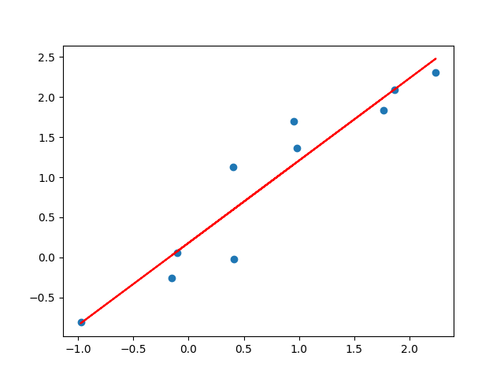
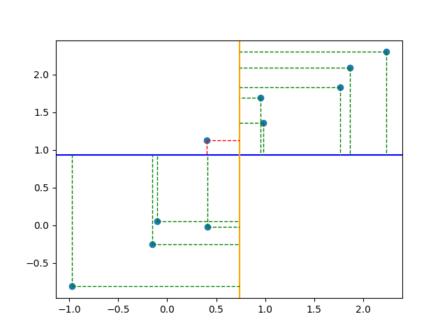
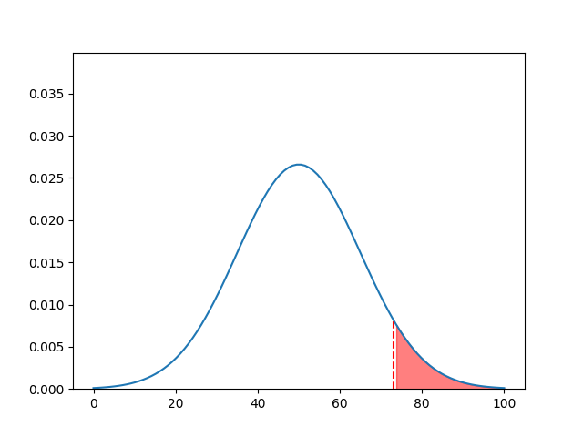
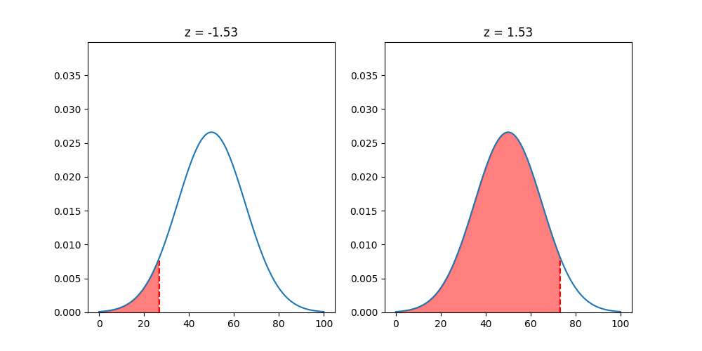
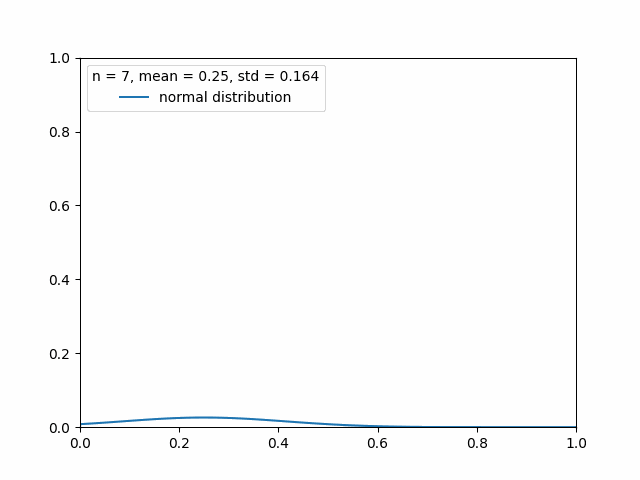
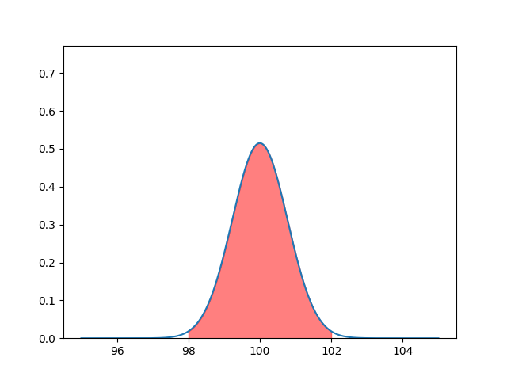

# [Recitation 1](https://elearning.uniroma1.it/pluginfile.php/1249385/mod_resource/content/0/Recitation1.pdf)
---


## Exercise 1


1. <u>Students. </u>
	The subjects are the "keys" of the table. If i'm not retarded they should always be unique.
	
2. <u>Gender, Grade, City, Faculty, Family Income.</u>
	The variables are just the fields of the table.
	
3. [[Variable types]]:
	1. Gender: <u>categorical</u> (Binary, with two categories M, F)
	2. Grade: <u>quantitative discrete</u>
	3. City: <u>categorical</u> (Nominal, with categories Milan, Rome, Naples, Florence)
	4. Faculty: <u>categorical</u> (Nominal, with categories Economics, Statistics, Political Sciences)
	5. Family Income: <u>quantitative continuous</u>


```ad-summary
title: Brief recap on variable types
#### Categorical (or Qualitative) variable

Each observation belongs to a category:
- Binary: There are only 2 categories
	
- Ordinal: The categories have a hierarchy or order.
	
- Nominal: No hierarchy is present.

<br>

#### Quantitative variable

Observations take numerical values that represent different magnitudes of the variable:
- Discrete: The possible values come from a specific set of numbers
	
- Continuous: The values are from an interval.

```


## Exercise 2


1. A [[Association|proportion]] is just $\large \frac{Frequency}{Total\, Observations}$:
	
	
2. Pretty simple innit:
	
	


## Exercise 3


1. The subjects here is the number of people in the family, and the frequency is how many families have this number of people in it:
	


## Exercise 4


1. This is getting boring:
	
	
2. An [histogram](../Statistics/Histogram.md) is a chart used to display numerical data.:
	 
	
```ad-note
title: Histogram vs Bar chart

<br>

The two main differences between a bar chart and a histogram are:
- The bar chart displays categorical discrete data
- The bars of the bar chart are not adjacent to each other, there is a slight padding.
```
	
3. <u>The distribution is unimodal and skewed to the right.</u>
	


```ad-question
When we convert from continuous to intervals, what is the type of the new variable?
```


## Exercise 5


1.  Each row is a data point, we treat IQ as the X variable and Salary as the Y variable, as we want to look at the correlation between Salary and IQ.
	


## Exercise 6


1. Mean, median and mode:
	1. [Mean](../Statistics/Mean.md): $\Large \frac{10+14+14+8+5+6+1+3+7+10+14+9}{12}\normalsize=8.41$
	2. [Median](../Statistics/Median.md): 
			First we sort the data: 1, 3, 5, 6, 7, 8, 9, 10, 10, 14, 14, 14. 
			The number of values is even, so we have 2 middle values, $8$ and $9$. 
			We take the mean of these two numbers: $\Large \frac{8+9}{2}\normalsize=8.5$.
	1. [Mode](../Statistics/Mode.md): $14$.
	
2. Median > Mean, therefore the distribution is slightly skewed to the left:
	
	
3. This question is so poorly written omfg, the new values are $1, 6, 10, 12, 14, 16, 18, 20, 20, 28, 28, 28$:
	1. Mean: $\Large \frac{2*(20+28+28+16+10+12+1+6+14+20+28+18)}{12}\normalsize=16.8$
	2. Median: The new middle values are $16$ and $9$, so the new median is $\large \frac{16+18}{2}\normalsize=17$.
	3. Mode: $28$.


## Exercise 7


1. Mean, and median:
	1. Mean: $\Large \frac{200+ 70+ 88+ 130+ 175+ 89+ 95+ 120+ 400+ 55}{10} \normalsize=142.2$
	2. Median: $\Large\frac{95+120}{2}\normalsize=107.5$
	
2. Skewed to the right, because Median < Mean.
	
3. New $\large\bar{x} = \Large \frac{1.1*(200+ 70+ 88+ 130+ 175+ 89+ 95+ 120+ 400+ 55)}{10}\normalsize= 1.1 * 142.2 = 156.4$
	
4. New $\large\bar{x} = \Large\frac{(10*10)+(200+ 70+ 88+ 130+ 175+ 89+ 95+ 120+ 400+ 55)}{10}\normalsize = 152.2$ 
	
5. New $\large\bar{x} = \Large \frac{(10*10)+1.1*(200+ 70+ 88+ 130+ 175+ 89+ 95+ 120+ 400+ 55)}{10}\normalsize=166.4$
	
6. Change in mean and median:
	1. New $\large\bar{x} = \Large \frac{200+ 70+ 88+ 130+ 175+ 89+ 95+ 120+ 4000+ 55}{10}\normalsize=502,2$
	2. Absolutely nothing lol. Because the order doesn't change and 400 wasn't in the middle anyways.


# [Recitation 2](https://elearning.uniroma1.it/pluginfile.php/1249383/mod_resource/content/0/Recitation2.pdf)
---
## Exercise 1


1. The sample [standard deviation](../Statistics/Standard%20Deviation.md) is computed as follows: $\Large \sqrt{\frac{\sum(x_i - \bar{x})^2}{N-1}}$
2. We are gonna do this later.

```ad-info
title: Why N - 1?
### This is a non-technical explanation
Because the sample standard deviation is computed as an approximation of the real standard deviation, from a sample of the population.

<br>

This means that the data point we get are more likely to be around the mean and less likely to be on the tails of the distribution.

<br>

So the sample standard deviation always underestimates the real value.

For this reason we decrease the denominator and overshoot the number.

```


## Exercise 2

We are gonna skip this for now


## Exercise 3


1. Mean and sample standard deviation:
	1. Mean: $\frac{57+35+61+64+90+78+60+53+55+57+71+30}{12}=59.25$
	2. Sample standard deviation = $\Large \sqrt{\frac{5.06+588.06+3.06+22.56+945.56+351.56+0.56+39.06+18.06+5.06+138.06+855.56}{11}}\normalsize=16.44$
2.  We got to split the observation in 4 subsets of equal length:
	1. First we sort the data: 30, 35, 53, 55, 57, 57, 60, 61, 64, 71, 78, 90.
	2. Then we do the thing: [30, 35, 53], [55, 57, 57], [60, 61, 64], [71, 78, 90]
	3. Then we compute the quartiles: $\large\frac{53+55}{2}\normalsize=54$ , $\large\frac{57+60}{2}\normalsize=58.5$, $\large\frac{64+71}{2}\normalsize=67.5$
	
```ad-hint
title: Quartiles recap
The Quartiles split the distribution into four parts that have the same number of observations:

<br>


<br>

You can find the quartiles by:
1. Ordering the set
2. Splitting the set in 4 subsets
3. Getting the mean between the extremes of the subsets

<br>

Example:

[30, 35, 53], [55, 57, 57], [60, 61, 64], [71, 78, 90]
- Q1 = $\large\frac{53+55}{2}\normalsize=54$
- Q2 = $\large\frac{57+60}{2}\normalsize=58.5$
- Q3 = $\large\frac{64+71}{2}\normalsize=67.5$
```
	
 3. The mean, the quartiles, and the standard deviation all reduce by 5%:
	 1. New $\bar{x} = 0.95 ∗ 59.25 = 56.29$, 
	 2. New $\sigma_s = 0.95 ∗ 16.44 = 15.62$
	 3. New $Q1 = 0.95 ∗ 54 = 51.3$,
	 4. New $Q2 = 0.95 ∗ 58.5 = 55.58$, 
	 5. New $Q3 = 0.95 ∗ 67.5 = 64.13$.

4. We do the same thing for some reason:
	 1. New $\bar{x} = 2∗59.25+3 = 121.5$, 
	 2. New $\sigma_s = 2 ∗ 16.44 = 32.882$,
	 3. New $Q1 = 2∗54+3 = 111$,
	 4. New $Q2 = 2 ∗ 58.5 + 3 = 120$, 
	 5. New $Q3 = 2 ∗ 67.5 + 3 = 138$.
	
5. Range and IRQ. 
	1. Range is just the max - min value. 
	2. IRQ is the length of the interval [Q1, Q3].
	
6. [[Box plot|Box pot]]:
	
	
```ad-example

```


I can't do all exercises, from here i just categorize them


# [Recitation 3](https://elearning.uniroma1.it/pluginfile.php/1259239/mod_resource/content/0/SolRecitation3.pdf)
---

## [Regression](../Statistics/Regression.md) line

Imagine need to find that line:



We don't have to bruteforce our way to the best-fitting line.
We already know that a line can be described with the following formula:

$$\large y=mx + q$$
1. We find r ([correlation coefficient](../Statistics/Correlation%20coefficient.md)):
	1.   We find the [covariance](../Statistics/Covariance.md): $\large cov(x,y)=\sum (x-\bar{x})(y-\bar{y})$  
	
	2.   Then:  $$r = \frac{cov(x,y)}{\sqrt{\sum (x - \bar{x})^2\sum (y - \bar{y})^2}}$$

2. We find $m$:
$$\large m=r(\frac{\sigma_y}{\sigma_x})$$
3. We find q using the mean values, because we are sure that they are on the [regression](../Statistics/Regression.md) line:
$$\large y = mx+q$$
$$\large q = \bar{y}-m\bar{x}$$


```ad-warning
If the exercise asks you to motivate why the regression line fits the data well, you say that $r^2 = tot\%$.

<br>

$tot\%$ of the variability of X is explained by Y.
```


## Residual

$$\text{e} = \text{prediction} - \text{ground truth}$$


# [Recitation 4](https://elearning.uniroma1.it/pluginfile.php/1259240/mod_resource/content/0/SolRecitation4n.pdf) 
---


## Sample space

It is the collection of all possible outcomes of an experiment.

A box contains four balls: one red, one blue, one yellow and one pink.
  
- **Consider an experiment that consists of drawing a ball from the box at random, replacing it, and drawing a second ball:**
	S = {RR, RB, RY, RP, BR, BB, BY, BP, YR, YB, YY, YP, PR, PB, PY, PP}
	
- **Let A be the event that the first ball drawn is Yellow. List all outcomes in A:**
	A = {YR, YB, YY, YP}
	
- **Let B the event that both balls have the same color. List all the outcomes in B:**
	B = {RR, BB, YY, PP}
	


## Probabilities

We are in the same sample space as the examples above:

1. **Compute P(A) and P(Ac):**
	P(A) 1/4 = 0.25 
	P(Ac) = 1 - 0.25 = 0.75 
	
2. **Compute P(B) and P(Bc):**
	P(B) = 1/4 = 0.25 
	P(Bc) = 1 - 0.25 = 0.75 
	
3. **Compute P(A and B):**
	P(A and B) = P(A ∩ B) = 1/16 = 0.0625 
	
4. **Compute P(A or B):**
	P(A or B) = P(A ∪ B) = 0.25 + 0.25 - 0.06 = 0.44 
	
5. **Compute P(A | B):**
	P(A | B) = 0.0625/0.25 = 0.25
	
```ad-summary
title: Quick recap on [conditional probability](../Probability/Conditional%20Probability.md):
When we are searching for the probability of an event A given that another event B has already happened, we can restrict the sample space to the event B.

<br>

Now we search for the intersection of the two events in the sample space of B and we get this formula:

<br>

$$P(A \,|\, B) = \frac{P(A\, ∩ \,B)}{P(B)}$$
```


## Dependend and Independent Events

Two events are dependent if the happening of one of them changes the probability of the other one happening.

$$\large P(A\cap B) = P(A)\times P(B\,|\,A)$$

In this formula, the more B is independent from A, the more $P(B\,|\,A)$ approaches $P(B)$.
$$\large P(A\cap B) = P(A)\times P(B)$$


P(N) = 175 / 590 = 0.296
P(S) = 570 / 590 = 0.966
P(S|N) = 160 / 175 = 0.914

- **Compute the probability that an individual did not wear a seatbelt and survived:**
	P(N and S) = P(N) x P(S|N) = 0.296 x (160/175) = 0.27
	P(N and S) if independent = P(N) x P(S) = 0.296 x 0.966 = 0.286
	
	Since those two are not equal, the events are not independent.


# [Recitation 5](https://elearning.uniroma1.it/pluginfile.php/1259241/mod_resource/content/1/SolRecitation5.pdf)
---


## Probability distributions

We are sometimes asked to find the mean of a probability distribution. That is the [[Expected value|Expectation]]:
$$\large E[X]=\mu = \sum p(x) \,x$$

If we are asked to find the [variance](../Statistics/Variance.md):
$$\large \sigma^2=\sum (x-\mu)^2 P(x)$$
> [!tldr]
> Literally the expectation of the squared difference of the points from the mean.
> 
> $$\large E[(X - \mu)^2]$$

> [!NOTE] Note
> If you are asked to complete the distribution, remember that the y values must amount to 1.


## Normal curve and Z-Score


Some exercises may ask you to calculate the probability in an interval of the Normal distribution.

I think you would do this with integrals, but i guess that integrating the normal distribution might not be easy?

Anyway, we have this exercise:

**In a population the vehicle speed distribution is well approximated by a Normal curve with mean 50 and standard deviation 15.**

- **Compute the probability that a randomly selected vehicle speed is greater than 73**


### What is a [z-score](../Statistics/Z-score.md) and what's its purpose:

Basically the z-score is how many standard deviations our value is away from the mean.
The z-score is useful because it is standardized for the standard normal curve.

Basically if we get an exercise like the one above, where we would need to use an integral, we have a table of ready-to-go values, the z-table.


### The z-table:

The z-table assigns to every z-score the area under the curve up to that z-score(the left of it).
The table is computed from the standard normal curve, but the z-score is standardized, so if our distribution follows a normal curve we can use the table.


Getting back to the exercise:

**Compute the probability that a randomly selected vehicle speed is greater than 73:**

1.    We compute the z-score:
$$\large z = \frac{x - \mu}{\sigma} = 1.53$$



2.    Now we've got to use the z-table to find the area corresponding to the z-score of 1.53:


We use the entry -1.5 because if we used 1.53 we would get all the area to the left of 1.53, and we want the area to the right. We can use the negative z because the normal distribution is symmetric:



Our result is **0.063**.


> [!info]
> We could have also computed the complement of the area, instead of getting the inverse of the z-score.
> 
> This is because the total area of the normal curve is 1.


## [Binomial distribution](../Probability/Binomial%20distribution.md)

A binomial distribution can be thought of as simply the probability of a SUCCESS or FAILURE outcome in an experiment or survey that is repeated multiple times.

Binomial distributions must meet the following three criteria:

1.   **The number of observations or trials is fixed.** 
	In other words, you can only figure out the probability of something happening if you do it a certain number of times. This is common sense: 
	- If you toss a coin once, your probability of getting a tails is 50%. 
	- If you toss a coin a 20 times, your probability of getting a tails is very, very close to 100%.
	
2.   **Each observation or trial is independent.**  
	In other words, none of your trials have an effect on the probability of the next trial.
	
3.   The **probability of success** (tails, heads, fail or pass) is **exactly the same** from one trial to another.


The thing is imagine we flip a coin 5 times. There are $2^5=32$ equally likely outcomes. Now we want to know how many outcomes have 3 heads in them.
The formula to find out is:
$$\large P(x)=\frac{n!}{(n-x)!x!}p^xq^{n-x}$$
Where:
- $n$ is the number of trials or the size of the sample.
- $x$ is the number of successes, or in this case the number of heads.
- $p$ is the probability of success in one trial.
- $q=1-p$, or the probability of failure in one trial.
- $P(x)$ is the probability of getting x successes(here 3 heads) in $n$ trials with $p$ probability of success per trial.


Mean of a binomial distribution is given by:
$$\large E[X]=np$$
Variance of a binomial distribution is given by:
$$\large var(X) = np(p-1)$$

> [!hint]
> With big sample sizes this formula approximates to a normal distribution, so we can use z-scores to find areas under the curve.


# [Recitation 6](https://elearning.uniroma1.it/pluginfile.php/1259242/mod_resource/content/0/SolRecitation6.pdf)
---

## [Sampling distributions](../Statistics/Sampling%20distributions.md)

When people enter an apple store, $p=0.25$ of them buys a product before leaving. This is the real proportion, it is the ground truth and we have it.

Imagine we sample the population and try to obtain p from the samples. Now P becomes uncertain, it is [random variable](../Probability/Random%20variable.md) $\hat{P}$:


According to the [Central Limit Theorem](../Statistics/Central%20Limit%20Theorem.md), for large samples, the sample proportion is approximately normally distributed, with mean:
$$\large\mu_{\hat{P}}= p$$
and standard deviation:
$$\large\sigma_{\hat{P}}=\sqrt{\frac{pq}{n}}$$

Where:
- $p$ is the proportion/statistic of something.
- $q = 1-p$
- $\mu_{\hat{P}}$ is the mean of the distribution of sampled proportions.
- $\sigma_{\hat{P}}$ is the standard deviation of the sampled proportions.


If the statistic is not a proportion, the standard deviation is computed as:
$$\large \sigma_s = \frac{\sigma}{\sqrt{n}}$$

> [!warning]
> Sometimes we want to compute the probability of successes being more than a certain number. 
> 
> We know that we can get the area under a curve by using the z-scores, but this distribution only approximates a [normal distribution](../Statistics/Normal%20distribution.md) when using a large n.
> 
> So when we have a small n we need to go sideways:
> - If our configuration is also a [binomial distribution](../Probability/Binomial%20distribution.md), we can use that formula to compute every single discrete probability.
> 

> [!example]
> **For the population of individuals who own an iPhone, suppose p = 0.25 is the proportion that has a given app.**
> 
> 1. For a random sample of size n = 4, and the mean and the standard deviation of the sampling distribution of the sample proportion:
> 	$$\large \mu_{\hat{P}}=0.25, \quad\large \sigma_{\hat{P}}=\sqrt{\frac{0.25 \times 0.75}{4}}=0.216$$
> 	
> 
> 
> 2. Find the probability that the proportion of having the app is at least 0.75 when n = 4.
> 	
> 	Here the sample size is too small, so we can't use the [normal distribution](../Statistics/Normal%20distribution.md) stuff.
> 	0.75 of 4 = 3, so we need the probability that at least 3 people have the app. 
> 	We do that by  summing the probabilities that 3 people have the app and 4 people have the app.
> 	Since those probabilities are discrete and there are only 2 possible outcomes per trial, we can use the binomial distribution formula
> 	

> [!example]
> **In the population, IQ scores are normally distributed with mean µ = 100 and variance σ 2 = 15. Suppose to draw a random samples of 25 individuals from the population and measure the IQ score**
> 
> 1. Compute the probability of observing a sample mean between 98 and 102 when drawing a sample of 25 individuals:
>   
> The standard deviation of the sample mean for a sample of size 25. Is given by:
> $$\large\sigma_s = \frac{\sigma}{\sqrt{n}}=\frac{\sqrt{15}}{\sqrt{25}}=0.774$$ 
> 
> The z-scores for 98 and 102 are:
> $$\large z_1 = \frac{98-100}{0.774}=-2.582,\quad z_2 = \frac{102-100}{0.774}=2.582$$
> 
> The areas given by the z-tables for the z-scores are:
> $$\large A_{z1}=0.0049,\quad A_{z2}=0.9950$$
> 
> The area between the two z-scores is given by:
> $$\large A_{z2-z1} = A_{z2} - A_{z1} = 0.9950 - 0.0049 = 0.9901$$
> 
> 



# [Recitation 7](https://elearning.uniroma1.it/pluginfile.php/1266646/mod_resource/content/0/SolRecitation7.pdf)
---


## [Standard Error](../Statistics/Standard%20Error.md)

It's the average error of the [estimation](../Statistics/Estimation.md) from the samples:
$$\large e=\frac{\sigma}{\sqrt{n}}$$

## [Confidence interval](../Statistics/Confidence%20interval.md)
