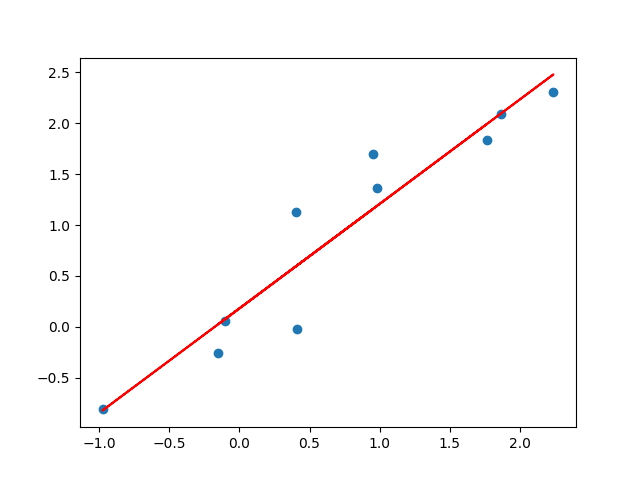
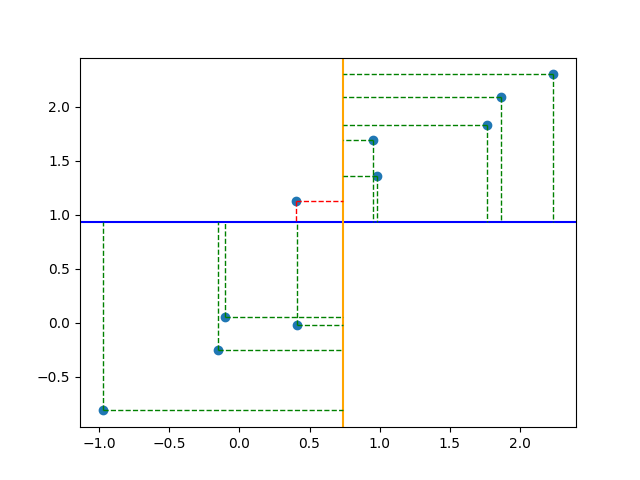

# [Recitation 1](https://elearning.uniroma1.it/pluginfile.php/1249385/mod_resource/content/0/Recitation1.pdf):


## Exercise 1


1. <u>Students. </u>
	The subjects are the "keys" of the table. If i'm not retarded they should always be unique.
	
2. <u>Gender, Grade, City, Faculty, Family Income.</u>
	The variables are just the fields of the table.
	
3. [[Variable types]]:
	1. Gender: <u>categorical</u> (Binary, with two categories M, F)
	2. Grade: <u>quantitative discrete</u>
	3. City: <u>categorical</u> (Nominal, with categories Milan, Rome, Naples, Florence)
	4. Faculty: <u>categorical</u> (Nominal, with categories Economics, Statistics, Political Sciences)
	5. Family Income: <u>quantitative continuous</u>


```ad-summary
title: Brief recap on variable types
#### Categorical (or Qualitative) variable

Each observation belongs to a category:
- Binary: There are only 2 categories
	
- Ordinal: The categories have a hierarchy or order.
	
- Nominal: No hierarchy is present.

<br>

#### Quantitative variable

Observations take numerical values that represent different magnitudes of the variable:
- Discrete: The possible values come from a specific set of numbers
	
- Continuous: The values are from an interval.

```


## Exercise 2


1. A [[Association|proportion]] is just $\large \frac{Frequency}{Total\, Observations}$:
	
	
2. Pretty simple innit:
	
	


## Exercise 3


1. The subjects here is the number of people in the family, and the frequency is how many families have this number of people in it:
	


## Exercise 4


1. This is getting boring:
	
	
2. An [histogram](../AI-LAB/Histogram.md) is a chart used to display numerical data.:
	 
	
```ad-note
title: Histogram vs Bar chart

<br>

The two main differences between a bar chart and a histogram are:
- The bar chart displays categorical discrete data
- The bars of the bar chart are not adjacent to each other, there is a slight padding.
```
	
3. <u>The distribution is unimodal and skewed to the right.</u>
	


```ad-question
When we convert from continuous to intervals, what is the type of the new variable?
```


## Exercise 5


1.  Each row is a data point, we treat IQ as the X variable and Salary as the Y variable, as we want to look at the correlation between Salary and IQ.
	


## Exercise 6


1. Mean, median and mode:
	1. [Mean](../Statistics/Mean.md): $\Large \frac{10+14+14+8+5+6+1+3+7+10+14+9}{12}\normalsize=8.41$
	2. [Median](../Statistics/Median.md): 
			First we sort the data: 1, 3, 5, 6, 7, 8, 9, 10, 10, 14, 14, 14. 
			The number of values is even, so we have 2 middle values, $8$ and $9$. 
			We take the mean of these two numbers: $\Large \frac{8+9}{2}\normalsize=8.5$.
	1. [Mode](../Statistics/Mode.md): $14$.
	
2. Median > Mean, therefore the distribution is slightly skewed to the left:
	
	
3. This question is so poorly written omfg, the new values are $1, 6, 10, 12, 14, 16, 18, 20, 20, 28, 28, 28$:
	1. Mean: $\Large \frac{2*(20+28+28+16+10+12+1+6+14+20+28+18)}{12}\normalsize=16.8$
	2. Median: The new middle values are $16$ and $9$, so the new median is $\large \frac{16+18}{2}\normalsize=17$.
	3. Mode: $28$.


## Exercise 7


1. Mean, and median:
	1. Mean: $\Large \frac{200+ 70+ 88+ 130+ 175+ 89+ 95+ 120+ 400+ 55}{10} \normalsize=142.2$
	2. Median: $\Large\frac{95+120}{2}\normalsize=107.5$
	
2. Skewed to the right, because Median < Mean.
	
3. New $\large\bar{x} = \Large \frac{1.1*(200+ 70+ 88+ 130+ 175+ 89+ 95+ 120+ 400+ 55)}{10}\normalsize= 1.1 * 142.2 = 156.4$
	
4. New $\large\bar{x} = \Large\frac{(10*10)+(200+ 70+ 88+ 130+ 175+ 89+ 95+ 120+ 400+ 55)}{10}\normalsize = 152.2$ 
	
5. New $\large\bar{x} = \Large \frac{(10*10)+1.1*(200+ 70+ 88+ 130+ 175+ 89+ 95+ 120+ 400+ 55)}{10}\normalsize=166.4$
	
6. Change in mean and median:
	1. New $\large\bar{x} = \Large \frac{200+ 70+ 88+ 130+ 175+ 89+ 95+ 120+ 4000+ 55}{10}\normalsize=502,2$
	2. Absolutely nothing lol. Because the order doesn't change and 400 wasn't in the middle anyways.


# [Recitation 2](https://elearning.uniroma1.it/pluginfile.php/1249383/mod_resource/content/0/Recitation2.pdf)

## Exercise 1


1. The sample [standard deviation](../Statistics/Standard%20Deviation.md) is computed as follows: $\Large \sqrt{\frac{\sum(x_i - \bar{x})^2}{N-1}}$
2. We are gonna do this later.

```ad-info
title: Why N - 1?
### This is a non-technical explanation
Because the sample standard deviation is computed as an approximation of the real standard deviation, from a sample of the population.

<br>

This means that the data point we get are more likely to be around the mean and less likely to be on the tails of the distribution.

<br>

So the sample standard deviation always underestimates the real value.

For this reason we decrease the denominator and overshoot the number.

```


## Exercise 2

We are gonna skip this for now


## Exercise 3


1. Mean and sample standard deviation:
	1. Mean: $\frac{57+35+61+64+90+78+60+53+55+57+71+30}{12}=59.25$
	2. Sample standard deviation = $\Large \sqrt{\frac{5.06+588.06+3.06+22.56+945.56+351.56+0.56+39.06+18.06+5.06+138.06+855.56}{11}}\normalsize=16.44$
2.  We got to split the observation in 4 subsets of equal length:
	1. First we sort the data: 30, 35, 53, 55, 57, 57, 60, 61, 64, 71, 78, 90.
	2. Then we do the thing: [30, 35, 53], [55, 57, 57], [60, 61, 64], [71, 78, 90]
	3. Then we compute the quartiles: $\large\frac{53+55}{2}\normalsize=54$ , $\large\frac{57+60}{2}\normalsize=58.5$, $\large\frac{64+71}{2}\normalsize=67.5$
	
```ad-hint
title: Quartiles recap
The Quartiles split the distribution into four parts that have the same number of observations:

<br>


<br>

You can find the quartiles by:
1. Ordering the set
2. Splitting the set in 4 subsets
3. Getting the mean between the extremes of the subsets

<br>

Example:

[30, 35, 53], [55, 57, 57], [60, 61, 64], [71, 78, 90]
- Q1 = $\large\frac{53+55}{2}\normalsize=54$
- Q2 = $\large\frac{57+60}{2}\normalsize=58.5$
- Q3 = $\large\frac{64+71}{2}\normalsize=67.5$
```
	
 3. The mean, the quartiles, and the standard deviation all reduce by 5%:
	 1. New $\bar{x} = 0.95 ∗ 59.25 = 56.29$, 
	 2. New $\sigma_s = 0.95 ∗ 16.44 = 15.62$
	 3. New $Q1 = 0.95 ∗ 54 = 51.3$,
	 4. New $Q2 = 0.95 ∗ 58.5 = 55.58$, 
	 5. New $Q3 = 0.95 ∗ 67.5 = 64.13$.

4. We do the same thing for some reason:
	 1. New $\bar{x} = 2∗59.25+3 = 121.5$, 
	 2. New $\sigma_s = 2 ∗ 16.44 = 32.882$,
	 3. New $Q1 = 2∗54+3 = 111$,
	 4. New $Q2 = 2 ∗ 58.5 + 3 = 120$, 
	 5. New $Q3 = 2 ∗ 67.5 + 3 = 138$.
	
5. Range and IRQ. 
	1. Range is just the max - min value. 
	2. IRQ is the length of the interval [Q1, Q3].
	
6. [[Box plot|Box pot]]:
	
	
```ad-example

```


I can't do all exercises, from here i just categorize them


## [Correlation coefficient](../Statistics/Correlation%20coefficient.md)


## [Regression](../Statistics/Regression.md) line

Imagine need to find that line:



We don't have to bruteforce our way to the best-fitting line.
We already know that a line can be described with the following formula:

$$\large y=mx + q$$
1. We find r([correlation coefficient](../Statistics/Correlation%20coefficient.md)):
	1.   We find the covariance: $\large cov(x,y)=\sum (x-\bar{x})(y-\bar{y})$  
	
	2.   Then the correlation coefficient: $r = \Large \frac{cov(x,y)}{\sqrt{\sum (x - \bar{x})^2\sum (y - \bar{y})^2}}$

2. We find $m$:

$$\large m=r(\frac{\sigma_y}{\sigma_x})$$
3. We find q using the mean values, because we are sure that they are on the regression line:
$$\large y = mx+q$$
$$\large q = \bar{y}-m\bar{x}$$

