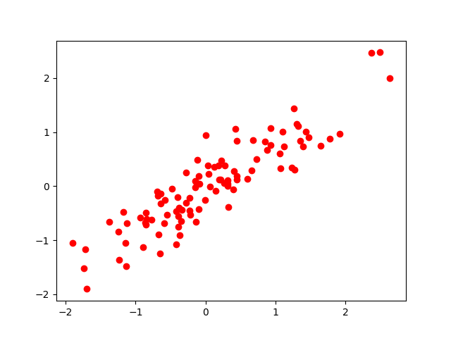

Suppose we have a point cloud like this:



Recall that the principal component of a point cloud is the unit vector that maximises the variance.

We compute that variance by using this formula:
$$\large var = \vec{v}^T\Sigma \vec{v}$$

Maximizing any function of the form above, where $\vec{v}$ is a normalized unit vector, can be formulated as a so called [Rayleigh Quotient](https://en.wikipedia.org/wiki/Rayleigh_quotient "Rayleigh Quotient").

The maximum of such a Rayleigh Quotient is obtained by setting $\vec{v}$ equal to the largest eigenvector of matrix $\Sigma$.

---

## Formula explanation

Basically $\vec{v}^T\Sigma \vec{v}$ gets you the variance in the direction of the vector $\vec{v}$.

Imagine $\vec{v}$ is the biggest principal component of the data shown above(so the first eigenvector of its covariance matrix), 

```ad-quote
The eigenvector of a matrix $A$ is a unit vector that when transformed by $A$, doesn't change direction but just gets scaled by its corresponding eigenvalue $\lambda$.
```

So, if we multiply $\vec{v}$ by covariance matrix $\Sigma$, we are basically just stretching it(by its $\lambda$).

The norm of the new stretched vector $\Sigma \vec{v}$ is now equal to the variance in its direction(or $\lambda$ in this case since its an eigenvector).

I haven't had time to finish this part yet.


```ad-seealso
### A geometric interpretation of the covariance matrix
https://www.visiondummy.com/2014/04/geometric-interpretation-covariance-matrix/
```
