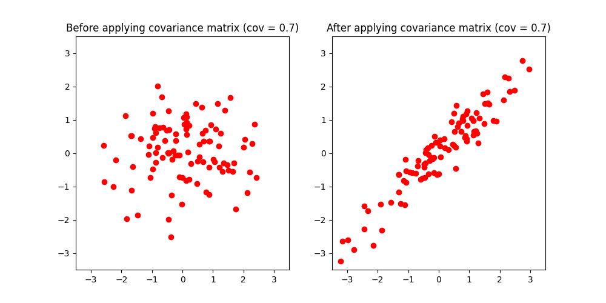
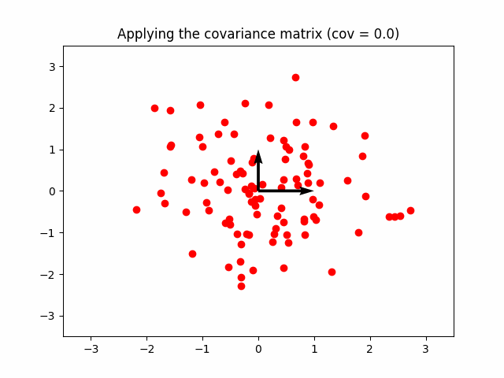

The covariance matrix is defined as a square matrix where the diagonal elements represent the variance and the off-diagonal elements represent the covariance.

$$\large \begin{bmatrix}
var(x) & cov(x, y) \\
cov(x, y) & var(y)
\end{bmatrix}$$


## How to compute it
$$\large C_{i,j}=cov(D_i\,, \;D_j)$$Where $D_i$ and $D_j$ are the variables/dimensions(ex. x and y).
Visually:

$$\large C=\begin{bmatrix}
cov(x, x) & cov(x, y) \\
cov(x, y) & cov(y, y)
\end{bmatrix}$$

Since $\large cov(k, k)=var(k)$, the elements on the diagonal are all variances.
An alternative formula that takes a whole matrix as input:

$$\large C = \frac{XX^T}{1-n}$$

```ad-example
Take this sample data, the variables are x and y:

<br> 

| Index | X         | Y         |
|-------|-----------|-----------|
| 0     | -2.123062 | -2.267402 |
| 1     | -1.775958 | 0.070899  |
| 2     | -1.582416 | -3.072345 |
| 3     | -0.492453 | -0.920361 |
<br>


Let's actually compute it using the formula $\large C = \frac{XX^T}{1-n}$:

<br>


$\large \begin{bmatrix}
-2.12 & -2.26 \\
-1.77 & 0.07 \\
-1.58 & -3.07 \\
-0.49 & -0.92
\end{bmatrix} 
\begin{bmatrix}
-2.12 & -1.77 & -1.58 & -0.49 \\
-2.26 & 0.07 & -3.07 & -0.92
\end{bmatrix}^T$


```

$$\large \begin{bmatrix}
-2.12\begin{bmatrix}
-2.12\\
-1.77\\
-1.58\\
-0.49
\end{bmatrix} + 
-2.26\begin{bmatrix}
-2.26\\
0.07\\
-3.07\\
-0.92
\end{bmatrix},\quad
\end{bmatrix}$$

Fuck this, let's do something more interesting...

---

## Covariance matrix as a transformation

As you may already know, if you multiply white data by a covariance matrix $\Sigma$:

$$\LARGE \Sigma = \begin{bmatrix}
1 & 0.7 \\
0.7 & 1
\end{bmatrix}$$

The white data becomes a point cloud with correlated dimensions:




```ad-hint
title: Why does it transform like that?

Because the unit vectors now become:

$$\large \hat{i}=\begin{bmatrix}
1 \\ 0.7
\end{bmatrix}, \quad
\hat{j}=\begin{bmatrix}
0.7 \\ 1
\end{bmatrix}
$$

<br>


```
