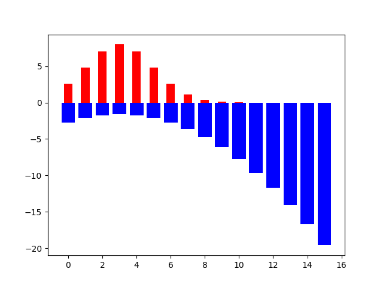
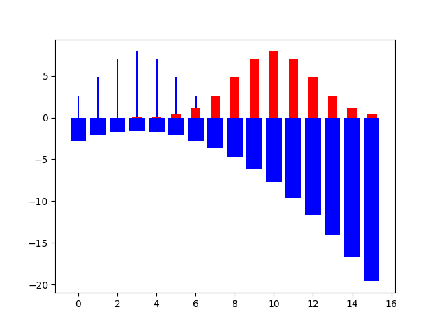

Cross-entropy is commonly used to quantify the difference between two probability distributions.
It is used in machine learning to estimate the loss/error for categorical multi-class classification.

The formula for cross-[[impurity functions|entropy]] is:
$$\large H(x) = -\sum_{x \in X} p(x)\log q(x)$$

```ad-hint
title: Formula explanation
Imagine that we have a distribution P(x) and a distribution Q(x).

- $h(x)=\log p(x)$ is the number of bits required to represent the event x in distribution P.
- $h(x)=\log q(x)$ is the number of bits required to represent the event x in distribution Q.

<br>

When we compute entropy of P(x), we are getting the average number of bits that are used to represent any event x in P:
- The weights/frequencies of events is given by P(x)
- The actual number of bits for any of these events is given by $\log p(x)$.

<br>

Here we have the P(x) distribution in red and its $\log p(x)$ in blue:

<br>



<br>

You can see that the less probable an event x is, the more information(surprise, given by $\log p(x)$) is needed to represent it.

<br>

Now imagine that the distribution/frequency of events changes, while the number of bits necessary to represent any one of those events stays the same.

That basically changes the resulting average cost per event x for this configuration.

<br>



<br>

The events that needed a lot of bits to represent, are now a lot more.

So this <font color="#245bdb">encoding</font> is shit for this <font color="#c00000">distribution</font> of events.
```

```ad-hint
title: Some considerations
Given the definition above, we should understand that the cross-entropy can never be lower than the entropies of the two single distributions.

<br>

This is because the bits for each event are modeled on a specific distribution, and that is the best you can do on it. 

<br>

When you change the distribution of events, it all goes to shit.
```


---

## Cross-Entropy as a loss function


```python
import numpy as np

# assume we are predicting a label for an instance

p = np.array([0, 1, 0])             # True probability (one-hot)
q = np.array([0.228, 0.619, 0.153]) # Predicted probability

cross_entropy_loss = -np.sum(p * np.log(q))
print(cross_entropy_loss)
# 0.47965000629754095
```
