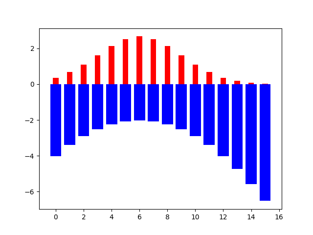

Measures impurity given a set of labels. They tell you how pure a set is.


We will cover a few impurity functions:
- Missclassification
- Gini Index
- [Entropy](Entropy.md)

---

## Missclassification

A few definitions:

- $K \leftarrow$ number of classes 
- $k\leftarrow$ a specific class
- $S \leftarrow$ set of data points
- $S_k \leftarrow$ points with label k
- $p_k=\large \frac{\left | S_k \right |}{\left | S \right |}\leftarrow$ the probability of picking a point with label $k$


The formula for Missclassification is:
$$\large H(S) = 1 - \max_k(p_{k})$$
The lower the missclassification is, the better.

```ad-hint
title: Formula explanation
It gives you the complement of the probability of picking the most probable label.

Or the probability of not picking the most probable class.

<br>

Some examples:

- impurity = 0: the set is pure, every point belongs to the same label.
- impurity = 1: the most probable label has 100% probability of not being picked, which means that every point has a different label. **I'M REALLY NOT SURE ABOUT THIS ONE**
```

```ad-example

Consider that $\large p_{red}=\frac{3}{4}$ and $\large p_{blue}=\frac{1}{4}$.

<br>


<br>

Then Missclassification:
$$\large H(S) = 1 - \max(p_{k}) = 1-\max\{\frac{3}{4},\frac{1}{4}\} = \frac{1}{4} = 25\%$$

<br>

Let's do another example with 3 classes,

Consider that $\large p_{red}=\frac{2}{4}$ and $\large p_{blue}=\frac{1}{4}$ and $\large p_{green}=\frac{1}{4}$.

<br>


<br>

Now the missclassification is:

$$\large H(S) = 1 - \max(p_{k}) = 1-\max\{\frac{2}{4},\frac{1}{4},\frac{1}{4}\}=50\%$$
```

---

## Gini impurity

The definitions are the same as before:

- $K \leftarrow$ number of classes 
- $k\leftarrow$ a specific class
- $S \leftarrow$ set of data points
- $S_k \leftarrow$ points with label k
- $p_k=\large \frac{\left | S_k \right |}{\left | S \right |}\leftarrow$ the probability of picking a point with label $k$

The formula for Gini Impurity is:
$$\large G(S)=\sum_{k=1}^{K}p_k(1-p_k)$$

```ad-hint
title: Formula explanation
For each class $k$, we multiply the probability of picking k($p_k$) and its complement(the probability of not picking k). Then we are summing the results.
```

---

## [Entropy](Entropy.md)

The entropy describes the degree of confusion in the set.
Another way you can think of it, is that entropy describes how surprised we are when we pick a value from the set. (You wouldn't be very surprised if a dice had only 6s in it)

$$\large H(X) \doteq -\sum_{x \in X} p(x)\log_2 p(x)$$


```ad-hint
title: Formula explanation
Suppose we have a function $h(x)$ we call surprise, that measures our surprise if the label $x$ is picked.

<br>

- $p(x) = 1$ we want $h(x)=0 \rightarrow$ **[Boring] NO surprise, a very common event happens**
- $p(x) \rightarrow 0$ then $h(x)=\infty\rightarrow$ **[Excitment] Lots of surprise, a rare event happens**

<br>

This can be achieved if we set $\large h(x)$ to $\large\log_2 p(x)$:

<br>


<br>

Since we are dealing with probabilities, $\large p(x)$ will always be in [0, 1], so every value we feed to the log will come out negative.

<br>

We can see that the lower the probability for a label is, the more negative the log result will be:

<br>



<br>

Now we may have the surprise for each label, but we want to compute the average surprise for every trial.

<br>

We can do just that by computing the [[Expected value|Expectation]] for the $h(x)$ distribution:

<br>

$$\large E[h(x)] = \sum_{x \in X} p(x)h(x) = \underbracket{\sum_{x \in X} p(x)\underbracket{\log_2 p(x)}_{\text{h(x) or surprise}}}_{\text{Expected value of h(x)}}$$

<br>

This average surprise measure, or the expectation of $h(x)$ is exactly what entropy is.
```

```ad-example


<br>

Here the entropy of A is lower than the entropy of B.

<br>

A) 

<br>

B) 
```


---

```ad-seealso
title: Useful links for a better understanding
https://randompearls.medium.com/information-theory-rationale-behind-using-logarithm-for-entropy-335d8e942e53
```
