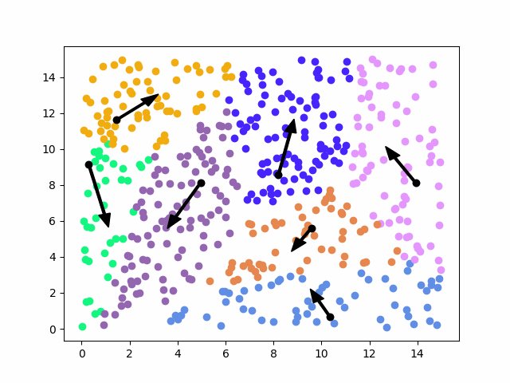

- **Initialization step:** we take K random centroids from the space.
- **Assignment step:** For each point, we get the closest centroid, the point now belongs to that centroid. The assignments can move but the centroids are fixed.

```python
# for each point, calculate the distance to the centroids and assign it to the closest centroid
for point in zip(x, y):
	
	distances = []
	
	for centroid in assignments.keys():
		
		distances.append(distance(point, centroid))
		
	assignments[get_closest_centroid(distances, centroids)].append(point)
```

- **Update step:** Now the assignments are fixed but the centroids can move. We loop over the centroids. We calculate new centroids by getting the means of the new-formed clusters(by assignments).

```python
# compute the new centroids
new_centroids = []

for centroid, points in assignments.items(): # assignments: dict[centroid, points]
	
	new_centroids.append(get_x_mean(points), get_y_mean(points)),
```

- We repeat from assignment step until the algorithm converges.


```ad-example


<br>


```

```ad-note
title: Voronoi regions
K-means can also be used to get the boundaries of the voronoi regions.

<br>


```


## K-means as a loss minimization problem

$$\large \mathcal{L}(\mu,y;D) = \sum_{i=1}^N \left| \left| x_i - \mu_{y_i} \right|\right|_2^2$$

This is the criterion for separating samples in K groups of equal [variance](../Statistics/Variance.md). By minimizing a the "inertia" or "within-cluster sum-of-squares"

There are only 2 points in which k-means changes its values:

- We fix centroids, and then we try to optimize y.
- We fix y, and then we try to optimize the centroids.

Those two operations will never increase the value of the loss, at most it stays the same.
Tries to minimize the [spread](../Statistics/Spread.md) of each cluster.


## Convergence

K-means is always guaranteed to converge(to end), at least to a local optimum.


## Furthest-first Heuristics

How do we choose the initial centroids effectively?

We choose the first one arbitrarily from the data points.
The other ones, we try to place them <font color="#b2a2c7">as far away as possible from all the centroids</font> that we just placed.

$$\large m =\underbrace{\arg\max_m \underbrace{\big( \min_{k<k^{\prime}} \left| \left| x_m - \mu_k^{\prime}\right|\right|_2^2 \big)}_{\text{fix m, distance of closest centroids}}}_{\text{select points with max distances from previous}}$$


```python
centroids = [(random_x, random_y)]
for k in range(K):
	# for each point, get their closest centroid and get the distance from it
	closest_centroids = [point, min(centroids, key=|point - c|) for point in points]
	
	# now get the max distance of every point from their closest centroid
	new_centroid = max(closest_centroids, key=|point - centroid|)[0]
	
	centroids.append(new_centroid)

# this is not strict python and it is not efficient, only for a better understanding.
```

To select a new centroid:
1. We iterate through every point and for each one we get the closest centroid of all the previous ones.
2. Then we select the point that has the greatest distance from its selected centroid.
3. That will be our new centroid.

This approach has a big problem though, because the centroids are always gonna be placed on outliers, if there are any.


## K-means++

We have an outliers problem. 
<font color="#b2a2c7">We don't take the max() anymore</font>(for the distance from the nearest centroids), because if we do that, if there is an outlier, the centroid will stabilize on that outlier.
<font color="#b2a2c7">We don't like this</font> because the outlier could take out a whole possible cluster.

$$\large Pr[\mu_k=x_m] \propto \min_{k<k^{\prime}} || x_m - \mu_k^{\prime}||_2^2$$

So instead of taking the max (the outlier for sure), every point as a probability of being the new centroid.
The probability of each point of being selected is proportional to the distance from their nearest centroid.
<font color="#b2a2c7">The higher this distance is, the higher probability the point has of being the new centroid.</font>

```ad-note
-   Note that `randomness(K-means++) > randomness(Kmeans + Furthest-first)` becuse with Furthest-first we select at randonm only at the start; then all the rest is deterministic.
-   With `Kmeans++` at each cluster selection there is stochasticity involved
```


But how do we actually sample from a set of distances?


## Inverse transform sampling

1. We turn the set D of distances into a [probability distribution](../Probability/Probability%20distribution.md)(the probability mass function).
	
$$\large p(d_i)= \frac{d_i}{\sum{D}}$$
	
```ad-seealso
title: Probability mass function Notion
$$\large p(d^{\prime})= \frac{d^{\prime}}{\sum_{d \in D} d}$$

<br>

This is the probability mass function, which gives the probability that the [random variable](../Probability/Random%20variable.md) takes the value d'. In other words, it maps each possible value of the random variable to its probability.

<br>

Where:
- $\large d'$: This is a specific value of the random variable that we want to find the probability of.
    
- $D$: This is the set of all possible values that the random variable can take.
    
- $\large \sum_{d \in D} d$: This is the sum of all possible values in the set D. It is the total weight/mass of the distribution.
    
- $\Large \frac{d'}{\sum_{d \in D} d}$: This is the probability that the random variable takes the value d', which is the ratio of the weight of d' to the total weight of the probability distribution. Specifically, it is the weight of d' divided by the sum of the weights of all possible values in D.

```
	
2. If D = [2.4, 1.5, 20.9, 12.5, 7.8], and their sum is 45,1, applying $\large p(d)$ gives us that $P_D$ = [0,053, 0,033, 0.463, 0.277, 0.172]. Imagine these as intervals on an axis. Each one of those intervals represents an element of D.
	
3. Now if we just take a random value between [0, 1] and we land it on $P_D$. Depending on where it lands, we choose the element. 
	
4. There we fucking have it, we have just used our distribution to give weights to the elements of D.

This is not really correct but who gives a shit?


## Parametrization by norm

By choosing the type of norm that we use to compute distances, we can produce a whole family of algorithms.


## How to choose K?

We need to get the k that gives a large gap between k-1 means and k-means cost functions.

We can't simply use the loss function(it would be overfitting).
We pay a penalty depending on the number of k(number of clusters).
You are allowed to change the number of clusters


We construct a new loss function:

$$\large\arg\min_K \mathcal{L}_K  + \underbrace{K\cdot 2D}_{\text{regularization}}$$
Where:
- $\arg\min_K \mathcal{L}_K$ = minimum loss with k clusters.
- Penalty for the number of clusters.


## Color compression

We want to compress the colors in an image to make it smaller on the disk:


Look at the color space as a 3d space with axis R, G and B:


You cluster the colors with k-means, and you get the centroids:


When you get k colors, every pixel now becomes a pointer to one of those colors. If you have 16 colors, each pixel is composed by just 4 bits.


## Bag of visual words(non ho capito un cazzo)

Nowadays, image recognition is done through neural networks, but before that we did it like this:

You cluster the images together(using k-means), then the centroids become the patch tokens.

We take patches of the image. We build an histogram of it.

