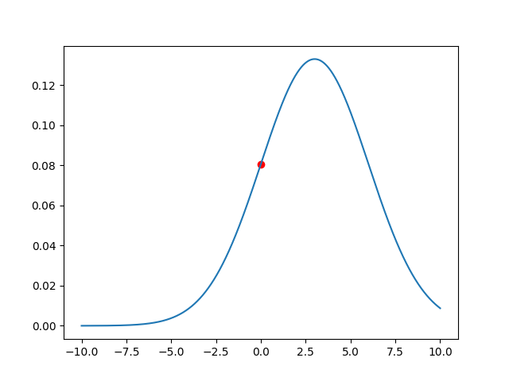

xWe want to regress a $y$ from $x$, starting from a finite number of datapoints:

So we want to learn a function $f_0$ such that $f_{\boldsymbol{\theta}}: \underbracket{x}_{\text{input}} \mapsto \underbracket{y}_{\text{output}}$, with unknown parameters ${\boldsymbol{\theta}}\doteq (\theta_0,\ldots,\theta_d)$.

---

## Linear Hypothesis

We assume that the function $f_0$ we are searching for, is linear.

$$\large f_{\boldsymbol{\theta}}(x) = \theta_0+ \theta_1\cdot x_1 + \theta_2\cdot x_2 + \ldots + \theta_d\cdot x_d$$

or

$$\large f_{\boldsymbol{\theta}}(x) = \big(\sum_{i=1}^d\theta_i\cdot x_i\big) + \theta_0$$

> [!hint]
> The number of parameters is equal to the number of dimensions, in this case 2.

---

## Loss/Cost function

$$\large\mathcal{J}(\theta;x,y)= \frac{1}{2} \sum_{i=1}^{n}\mathcal{L}\big(y_{i}, f_{\boldsymbol{\theta}}(x_i)\big)$$
where the loss is **the squared error:**

$$\large \mathcal{L}\big(y, f_{\boldsymbol{\theta}}(x)\big) = \big(f_{\boldsymbol{\theta}}(x) - y \big)^2$$

## Vectorization of loss function

We define the **design [matrix](../Linear%20Algebra/Matrix.md)** $X$, **label matrix** $y$ and the parameters as:

$$\large\def\horzbar{\rule[.5ex]{2.5ex}{0.5pt}}
X =
\left[
  \begin{array}{ccc}
    \horzbar & x^{T}_{1} & \horzbar \\
    \horzbar & x^{T}_{2} & \horzbar \\
             & \vdots    &          \\
    \horzbar & x^{T}_{n} & \horzbar
  \end{array}
\right]
\; \qquad
y =
\left[
  \begin{array}{c}
    {y}_{1} \\
    {y}_{2} \\
    \vdots \\
    {y}_{n} \\
  \end{array}
\right]
\; \qquad
\theta =
\left[
  \begin{array}{c}
    \theta_{0} \\
    \theta_{1} \\
    \vdots \\
    \theta_{d} \\
  \end{array}
\right]$$

> [!hint]
> $x_{i}^{T}$ is a vector(a datapoint in d+1 dimensions), that is transposed to fit in a row of the matrix.

> [!example] Design matrix example
> If we measure the height and weight of five individuals, we can collect the measurements in a design matrix having five rows and two columns.
> $$\large X=\begin{bmatrix}
> h_1 & w_1 \\
> h_2 & w_2 \\
> h_3 & w_3 \\
> h_4 & w_4 \\
> h_5 & w_5 \\
> \end{bmatrix}$$

Given this new vectorization, we can rewrite the cost function as:

$$\large\mathcal{J}(\theta;x,y)= \frac{1}{2} \sum_{i=1}^{n}  (\underbracket{\theta^Tx_i}_{f_{\boldsymbol{\theta}}} - y_i)^2=\frac{1}{2} \big(X\theta - y \big)^T\big(X\theta - y \big)$$

> [!hint] Formula Explanation
> $\theta^T x_i$ is the [dot product](../Linear%20Algebra/Dot%20product.md) between datapoint and parameters.
> 
> $$\large y=\begin{bmatrix}
> q & m
> \end{bmatrix} 
> \begin{bmatrix}
> x_0\rightarrow 1 \\
> x_1
> \end{bmatrix}=qx_0 + mx_1
> $$
> 
> The datapoint gets transformed by parameters like in a function, this can be also seen as the prediction.
> 
> $$\large\theta^T x_i=f(x_i)=\hat{y}$$
> 
> Given that, while remembering that the rows of X are the actual datapoints in transposed vector form:
> $$\large X\theta - y =
> 
> \begin{bmatrix}
> x_{1}^{T} \\
> x_{2}^{T} \\
> \vdots    \\
> x_{n}^{T} \\
> \end{bmatrix}
> \cdot
> \begin{bmatrix}
> \theta_{1} \\
> \theta_{2} \\
> \vdots    \\
> \theta_{n} \\
> \end{bmatrix}
> -
> \begin{bmatrix}
> y_{1} \\
> y_{2} \\
> \vdots    \\
> y_{n} \\
> \end{bmatrix}
> =
> \left[
>  \begin{array}{ccc}
>    & x^{T}_{1}\theta - y_1 &  \\
>     & x^{T}_{2}\theta - y_2 &  \\
>             & \vdots    &          \\
>     & x^{T}_{n}\theta - y_n & 
>  \end{array}
>\right]$$
>
>If we take the dot product between $(X\theta - y)$ and $(X\theta - y)^T$, we are basically taking every row(error for each datapoint) and we are squaring it.
>
>$$\frac{1}{2} \big(X\theta - y \big)^T\big(X\theta - y \big)= \frac{1}{2}
>
> \left[
>  \begin{array}{ccc}
>    x^{T}_{1}\theta - y_1 & x^{T}_{2}\theta - y_2 & \dots & x^{T}_{n}\theta - y_n
>  \end{array}
>\right]
>
> \left[
>  \begin{array}{ccc}
>    & x^{T}_{1}\theta - y_1 &  \\
>     & x^{T}_{2}\theta - y_2 &  \\
>             & \vdots    &          \\
>     & x^{T}_{n}\theta - y_n & 
>  \end{array}
>\right]
> $$

---

## Finding critical points

We set the [gradient](Gradient.md) to zero and we solve it.

$$\large\nabla_{\theta} \mathcal{J}(\theta;X,y)= \nabla_{\theta} \frac{1}{2} \big(X\theta - y \big)^T\big(X\theta - y \big) = 0$$

$$\nabla_{\theta} \frac{1}{2} \big[ (X\theta)^T(X\theta) - \underbracket{(X\theta)^Ty}_{\text{scalar}} -  \underbracket  {y^T(X\theta)}_{\text{scalar}}  + y^Ty \big]$$
$$\nabla_{\theta} \frac{1}{2} \big[ (X\theta)^T(X\theta) - 2\theta^T(X^Ty)  + y^Ty) \big]$$
$$\nabla_{\theta} \frac{1}{2} \big[ \theta^T(X^TX)\theta - 2\theta^T(X^Ty)  + y^Ty) \big]$$
$$\frac{1}{2} \big[ 2X^TX\theta - 2X^Ty \big] = 0$$

$$\large X^TX\theta = X^Ty$$

## Getting parameters at $\nabla = 0$

Assuming $X^TX$ is invertible, we can get the parameters by using an inverse formula of the last equation:
$$\large\theta = \underbracket{(X^TX)^{-1}X^T}_{\text{pseudo inverse}}y$$

There is also other stuff that I won't cover here, yet.

---

## Probabilistic view

We need to assume that each $y$ is generated linearly, but with additional Gaussian noise:
$$\large y_i = \theta^Tx_i + \epsilon$$
where
$$\large\epsilon = \mathcal{N}(0,\sigma^2)$$
-   We observe $(x_i,y_i)$ but we do not know $\theta$ and the noise ϵ.
-   The noise changes from sample to sample but we know it is distributed as Gaussian.

We can also express $f_0(x_i)$ as a [gaussian distribution](Gaussian%20distribution.md) centered on $\theta^{T} x_i$(because of the Gaussian distributed error).
$$\large p\left(y_i \mid x_i ; \theta\right)=\frac{1}{\sqrt{2 \pi} \sigma}^{\huge-\frac{\left(y_i-\theta^{T} x_i\right)^{2}}{2 \sigma^{2}}}$$

> [!hint] Formula Explanation
> The formula of the Gaussian Distribution is:
> $$\large P(x \mid \mu, \sigma^{2}) = \frac{1}{\sqrt{2\pi \sigma^{2}}}^{\huge- \frac{(x - \mu)^{2}}{2\sigma^{2}}}$$
> 
> This formula up there just uses $\theta^{T} x_i$ as the [mean](../Statistics/Mean.md) and the gaussian lives in the $y$ space.
> 
> 
> 

---

## Parameter estimation through [[Maximum Likelihood Principle|Maximum Likelihood]]

The formula $\large \frac{1}{\sqrt{2 \pi} \sigma}^{\LARGE-\frac{\left(y_i-\theta^{T} x_i\right)^{2}}{2 \sigma^{2}}}$ creates a gaussian centered at $\theta^{T} x_i$ and returns the height of the gaussian at $y_i$.

*($\theta^T x_i = 2.7$ and $y_i = 0$, $L=0.08$)*

This curve is useful because it gives us a measure of how much the gaussian fits the ground truth.
I'm talking about the likelihood, aka the height of the gaussian at $y_i$.

> [!tldr]
> The likelihood of a y is the probability of getting the ground truth value, based on the gaussian that is centered on the prediction($θ^T x_i$).
> 
> It is a measure of how well the gaussian fits our point.

So, for each datapoint, one of these gaussians gets created. 
The more $y_i$ is close to $\theta^{T} x_i$(mean of gaussian), the more likelihood we have(higher on the gaussian).

We have the maximum likelihood for a single point at $\theta^{T} x_i = y_i$.

### Here is an example:

We have 2 points in green and we want to get the best parameters for our regression line. 
Down below is the initial configuration:

We can also see that the error gaussians we have generated with the current parameters aren't really a great fit to the points, and so we get a low likelihood(green lines multiplied). We can do better.

We can see that changing the parameters also changes the predictions and, obviously, the mean of the gaussians change.
Now that the gaussians/predictions are more aligned with the ground truth we get more likelihood.

And the product of the likelihoods will be much higher.

> [!tldr]
> By changing the parameters we change the predictions. Each prediction carries a gaussian(centered on the predicted $y$).
> 
> If we project the ground truth y onto the gaussian we get the likelihood of getting that $y_i$ given $x_i$ and parameters $\theta$
> 
> We want to move our gaussians by changing the parameters, so that the likelihoods will be higher.

