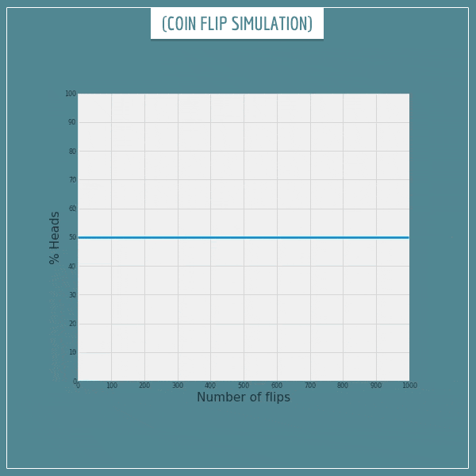

The Bernoulli distribution has a single parameter, often called **p**. 
The value of p is a real number in the interval [0, 1] and stands for the probability of one of the outcomes.

## Probability Mass function

$$\large f_X(x) = \begin{cases} p & \text{if }x=1, \\[6pt]1-p & \text {if }x=0.\end{cases}$$

---

## Mean

In order to compute the Expectation of a distribution, we just need to multiply each event by their probability and sum it all together:

$$\large E[x] = \mu = 1 \cdot p + 0\cdot(1 - p) $$

So the mean of a Bernoulli distribution with parameter $p$ actually approaches $p$ as the number of trials go to infinity(law of large numbers).

> [!example]
> A short simulation of 1000 random flips of a fair coin (p = 0.5):
> 
> 

---

## Variance

### WIP

> [!seealso]
> https://www.probabilisticworld.com/bernoulli-distribution-intuitive-understanding/#:~:text=Intuitively%2C%20you%20can%20read%20this,of%20one%20of%20the%20outcomes.
> 
