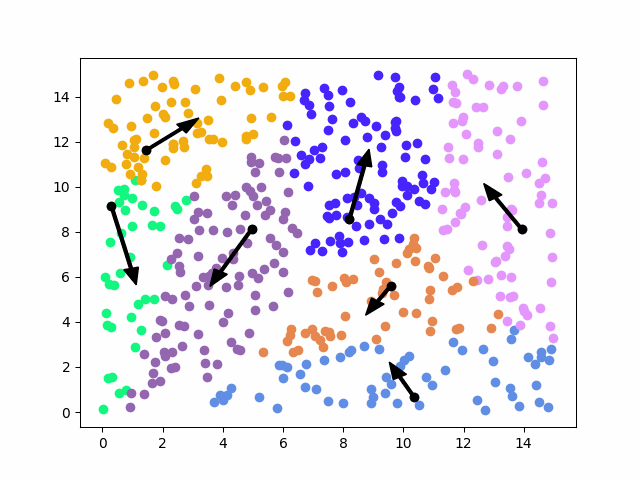

- **Initialization step:** we take K random centroids from the space.
- **Assignment step:** For each point, we compute the distance to the k random centroids, the point now belongs to that centroid. The assignments can move but the centroids are fixed.

```python
# for each point, calculate the distance to the centroids and assign it to the closest centroid
for point in zip(x, y):
	
	distances = []
	
	for centroid in assignments.keys():
	
		distances.append(distance(point, centroid))
	
	assignments[get_closest_centroid(distances, centroids)].append(point)
```

- **Update step:** Now the assignments are fixed but the centroids can move. We loop over the centroids. We calculate new centroids by getting the means of the new-formed clusters(by assignments).

```python
# calculate the new centroids
new_centroids = []

for centroid in assignments.keys():
	
	new_centroids.append(
		(
			sum([point[0] for point in assignments[centroid]]) / len(assignments[centroid]),

			sum([point[1] for point in assignments[centroid]]) / len(assignments[centroid]),
		)
	)
```

- We repeat from assignment step until the algorithm converges.


```ad-example


<br>


```

```ad-note
title: Voronoi regions
K-means can also be used to get the boundaries of the voronoi regions.

<br>


```


## K-means as a loss minimization problem

$$\large \mathcal{L}(\mu,y;D) = \sum_{i=1}^N \left| \left| x_i - \mu_{y_i} \right|\right|_2^2$$
This is the criterion for separating samples in K groups of equal variance. By minimizing a the "inertia" or "within-cluster sum-of-squares"

There are only 2 points in which k-means changes its values:

- We fix centroids, and then we try to optimize y.
- We fix y, and then we try to optimize the centroids.

Those two operations will never increase the value of the loss, at most it stays the same.

Tries to minimize the spread of each cluster.


## Convergence

K-means is always guaranteed to converge(to end), at least to a local optimum.


## Furthest-first Heuristics

How do we choose the initial centroids effectively?

We choose the first one arbitrarily from the data points.
The other ones, we try to place them as far away as possible from all the centroids that we just placed.

$$\large m =\underbrace{\arg\max_m \underbrace{\big( \min_{k<k^{\prime}} \left| \left| x_m - \mu_k^{\prime}\right|\right|_2^2 \big)}_{\text{fix m, distance of closest centroids}}}_{\text{select points with max distances from previous}}$$

## K-means++

We don't take max() across points when selecting the centroids.
We sample randomly but proportionally according to the distance between centroids.

$$\large Pr[\mu_k=x_m] \propto \min_{k<k^{\prime}} || x_m - \mu_k^{\prime}||_2^2$$

## Inverse transform sampling???
