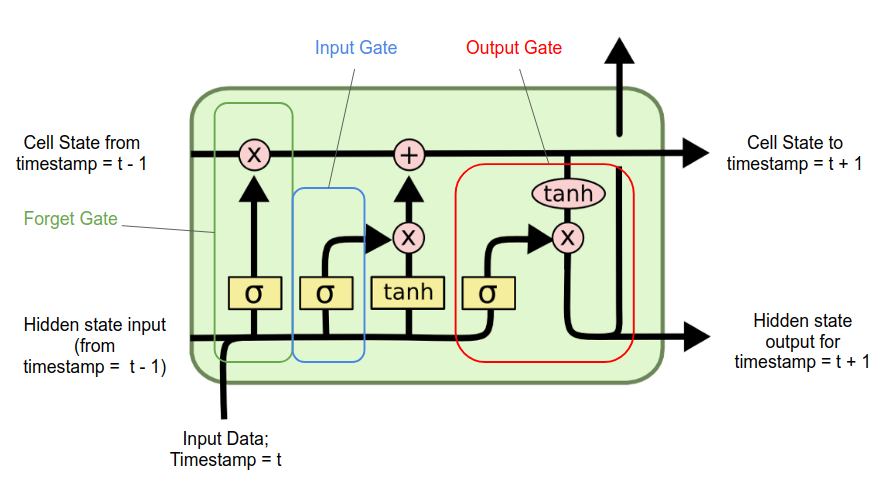

## Feedforward Exercises

> [!hint] Methods
> When the network has no activation functions, it means that each layer is just a linear map (doesn't contain any strange stuff) so it **can't possibly be equal to something that is non-linear**.
> 
> For the step activation functions, when you multiply the weight, the value scales accordingly, same for the threshold. So if threshold and value scale by the same scalar, the **output always remains the same**.

## Word2Vec Exercises

> [!hint] Method
> **Arcs are weights and nodes are neurons**.
> Considering that the embeddings are taken from the middle layer of this architecture, the layer has the same dimension as our desired output.
> 
> For arcs (connections between neurons) we just **multiply the input neurons by the middle layer dimension**, and then we do the **same for the other half **of the architecture.
> 
> For neurons, its just the fucking neurons.
> 

## GANs Exercises

> [!hint] Methods
> Important stuff for GANs training is:
> - During training, **neither** discriminator and generator **should dominate**, discriminator **accuracy should be 50%**.
> - During training, both discriminator and generator will **improve together constantly**.
> - Generator takes as input random noise.
> - Both real images and the generator are hooked to the discriminator. The **input of the discriminator will be a batch** in which **some images are real** and **some are not**.

## Recurrent Exercises

> [!hint] Method
> If we do matrix multiplication between the matrix and the vector, basically the vector will be reordered.
> 
> For example, if we multiply the first row with the vector, we get $x_3$, which will be the first element of the new vector. Then [1 0 0] corresponds to $x_1$ and [0 1 0] corresponds to $x_2$.
> 
> In this second exercise, if we do this 3 times we get back to the original. Since 99 is a multiple of 3, it means that after 99 cycles we will be back to the original.
> 
> > [!hint]
> > Notice that we can discard all the results that have been scaled, because we know that we don't have any scaling.

> [!hint] LTSM cell
> ## Parts of the LSTM cell
> 
> **Cell State**: The cell state, also known as the long-term memory, is a kind of "conveyor belt" that runs through the entire LSTM cell. It carries information that can be added to or removed from the cell state, regulated by structures called gates. The cell state can remember values over arbitrary time intervals, making it crucial for tasks that require memory of past information like time series prediction, text generation, and more.
> 
> 1. **Forget Gate**: The forget gate decides what information should be discarded from the cell state. Like the input gate, it uses a sigmoid activation function to output values between 0 and 1. A value of 0 means "completely forget this component", while a value of 1 means "completely retain this component".
> 2. **Input Gate**: The input gate decides how much of the new information from the current input should be stored in the cell state. It uses a sigmoid activation function to output values between 0 and 1, indicating how much of each component should be let through. A value of 0 means "ignore this component", while a value of 1 means "let this component through".
> 3. **Output Gate**: The output gate decides what the next hidden state (short-term memory) should be. This is based on the current input, the previous hidden state, and the updated cell state. Like the input and forget gates, the output gate uses a sigmoid activation function to control the amount of each component to let through
>    
>    

## Restricted Boltzmann Machine Exercises

> [!hint] Methods
> A scenario is a **subset of nodes**/neurons.
> Scenarios **extend the scenario A when they are connected to scenario A**. Since nodes in the same layer are not connected, AB doesn't extend A. But AD does.

## Logloss Exercises

## Gradient Descent Exercises

## Universal Approximation theorem Exercises

> [!hint] Universasl approximation theorem
> A feedforward neural network with finite number of neurons/single hidden layer can approximate continuous functions on compact subsets of $\mathbb{R}^n$, under assumptions on the activation function.
> 
> This means that with proper weights, a neural network can approximate any function.
> 
> The formula states that each point of the approximation is within error from the real function.
> 
> $$\large|N(x)-f(x)|< \epsilon$$

> [!hint] Methods
> Networks with tanh and sigmoid can approximate the same type of functions, since they are both s shaped and similar.

## Perceptron trick

Compute the classification, if it is right do nothing, if it is wrong change the weights
the formula is
$$\large \text{old weight} + lr(\text{label} -\text{pred})$$

