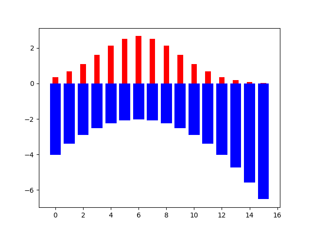

The entropy describes the degree of confusion in the set.
Another way you can think of it, is that entropy describes how surprised we are when we pick a value from the set. (You wouldn't be very surprised if a dice had only 6s in it)

$$\large H(X) \doteq -\sum_{x \in X} p(x)\log_2 p(x)$$


```ad-hint
title: Formula explanation
Suppose we have a function $h(x)$ we call surprise, that measures our surprise if the label $x$ is picked.

<br>

- $p(x) = 1$ we want $h(x)=0 \rightarrow$ **[Boring] NO surprise, a very common event happens**
- $p(x) \rightarrow 0$ then $h(x)=\infty\rightarrow$ **[Excitment] Lots of surprise, a rare event happens**

<br>

This can be achieved if we set $\large h(x)$ to $\large\log_2 p(x)$:

<br>


<br>

Since we are dealing with probabilities, $\large p(x)$ will always be in [0, 1], so every value we feed to the log will come out negative.

<br>

We can see that the lower the probability for a label is, the more negative the log result will be:

<br>



<br>

Now we may have the surprise for each label, but we want to compute the average surprise for every trial.

<br>

We can do just that by computing the [[Expected value|Expectation]] for the $h(x)$ distribution:

<br>

$$\large E[h(x)] = \sum_{x \in X} p(x)h(x) = \underbracket{\sum_{x \in X} p(x)\underbracket{\log_2 p(x)}_{\text{h(x) or surprise}}}_{\text{Expected value of h(x)}}$$

<br>

This average surprise measure, or the expectation of $h(x)$ is exactly what entropy is.
```

```ad-example


<br>

Here the entropy of A is lower than the entropy of B.

<br>

A) 

<br>

B) 
```
