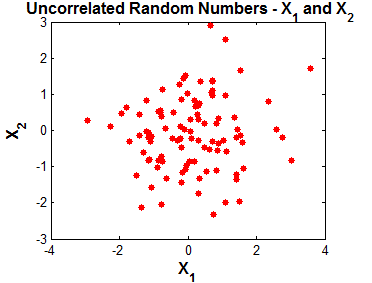
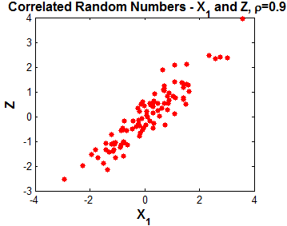

A [Gaussian distribution](Gaussian%20distribution.md) can be seen as a joint distribution $p(X,Y)$.
But what is exactly a joint distribution?

Consider we have two random variables X and Y.
A joint distribution is like uniting the distributions of the two random variables in one.

- If the two distribution are uncorrelated, it behaves like two normal and separate distributions.



- But if the two distributions are correlated, that is if the random variables affect each other, then the probabilities of the joint distribution follows the rules of [conditional probability](../Probability/Conditional%20Probability.md).



---

## Some definitions

```ad-summary
title: Sum rule of probability / Marginal probability
The probability $p(X)$ is called a marginal probability, because it leaves out the other variables, in this case $Y$.

The definition of marginal probability arises from the sum rule of probability:

<br>

$$\large p(X=x_i)=\sum^{}_{j=1}p(X=x_i,Y=y_i)$$

<br>

$p(X=x_i)$ is the probability that X will take value $\large x_i$.

<br>

The probability that $X$ equals $\large x_i$ is given by the sum of the probabilities of all the combinations in which $X = x_i$ (The other random variables take any value).

<br>


<br>

This is equal, to completely leaving out every other [random variable](../Probability/Random%20variable.md) apart from $X$.
```

```ad-summary
title: [Conditional probability](../Probability/Conditional%20Probability.md)

Suppose we are in the same environment as the picture above, the probability that an [event](../Probability/Event.md) after another event already happened is given by:

<br>


<br>

Which basically means that after the first event happened, our output space has been restricted to the outputs that were in the first event. So instead of calculating the probability over the total number of outputs, we now divide by the number of outputs in the first event.

```

---

## Joint = Marginal × Conditional

$$\large\underbracket{p(X,Y)}_{\text{joint}} = \underbracket{p(X)}_{\text{marginal}} \underbracket{p(Y|X)}_{\text{condit.}}$$

By multiplying the probability of $\large y_i$ given $\large x_i$, for the probability of $\large x_i$, we get the total probability for the combination $\large (x_i, y_i)$.


