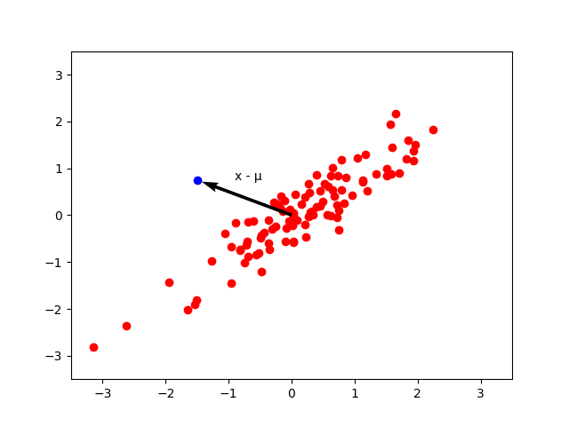
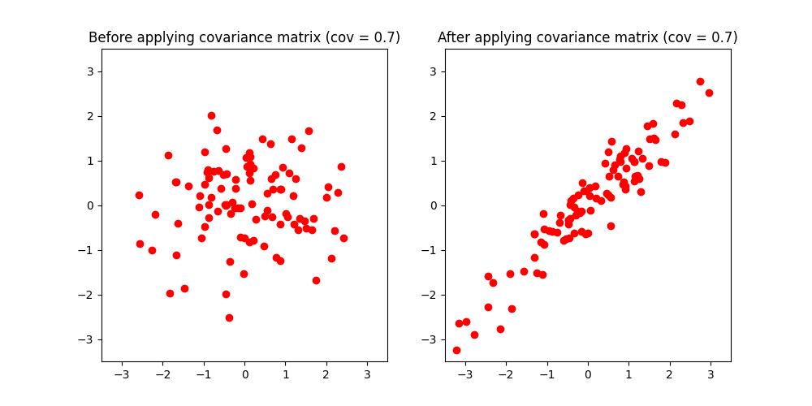
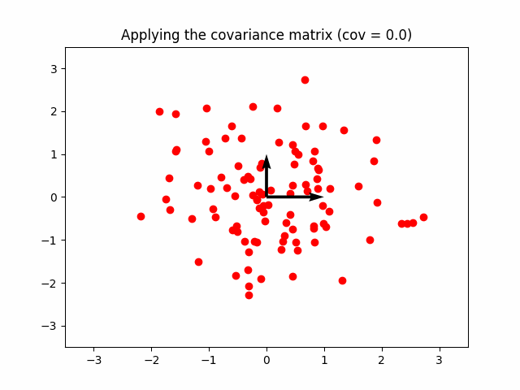
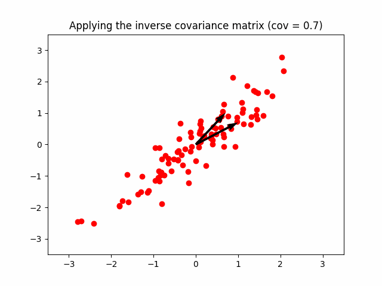

It measures how many standard deviations away x is from the mean of $\mathcal{N}(\mu,\Sigma)$.
Alternatively, it measures how far away a point is from a distribution/cluster(and not between two distinct points) like this:


The Mahalanobis distance is unitless, scale-invariant and takes into account the correlations of the data set.
If each of the axes are rescaled to have [variance](../Statistics/Variance.md) 1, the Mahalanobis distance corresponds to the standard Euclidean distance.

The formula is:
$$\large D_M(\vec{x}) = \sqrt{(x - \mu)^\mathsf{T} \mathbf{\Sigma}^{-1} (x - \mu)}$$

```ad-hint
title: Why don't we use the Euclidean distance?
Recall that the euclidean distance is simply a straight line between two points.

<br>

Euclidean distance will work fine as long as the dimensions are equally weighted and are indipendent of each other.

<br>

The Euclidean distance between a point and the center of the points (distribution) can give little or misleading information about how close a point really is to the cluster.

<br>


<br>

In the right image, if you use the euclidean distance, you wouldn't be able to spot the point in pink as an outlier, because it has the same distance as the point in purple, which is actually in the cluster.

<br>

So, it cannot be used to really judge how close a point actually is to a distribution of points.
```

---

## Formula explanation

This is what the Mahalanobis distance actually does:
1. Gets the vector representing the distance between the mean and the point
2. Undistorts the space/vector by applying the inverse [covariance matrix](Covariance%20matrix.md).
3. It calculates the euclidean distance, since there is no correlation anymore.


### 1) $\vec{(x-\mu)}$ - We get our vector

The vector $(x-\mu)$ starts from $\mu$ and ends at the point $x$ (see [[../Linear Algebra/Vectors|vector subtraction]]):




### 2) $\Sigma^{-1}\vec{(x-\mu)}$ - Inverse Covariance Matrix

As you may already know, if you multiply white data by a [covariance matrix](Covariance%20matrix.md) $\Sigma$:
$$\large \Sigma = \begin{bmatrix}
1 & 0.7 \\
0.7 & 1
\end{bmatrix}$$
The white data becomes a point cloud with correlated dimensions:




```ad-hint
title: Why does it transform like that?

Because the unit vectors now become:

$$\large \hat{i}=\begin{bmatrix}
1 \\ 0.7
\end{bmatrix}, \quad
\hat{j}=\begin{bmatrix}
0.7 \\ 1
\end{bmatrix}
$$

<br>


```

Of course, if you multiply a correlated distribution by the inverse of its [covariance matrix](Covariance%20matrix.md) $\Sigma^{-1}$, it becomes white data again, and there is no covariance anymore.



This is exactly what we are doing, we are undistorting the vector to make it land on a "circle" instead of an ellipse.


```ad-tldr
From this:


<br>

To this:


```


### 3) $\vec{(x-\mu)}\Sigma^{-1}\vec{(x-\mu)}$ - Get a scalar

Now that we have $\Sigma^{-1}\vec{(x-\mu)}$, we need a scalar representing a distance. We get that by doing a [dot product](../Linear%20Algebra/Dot%20product.md) with its distorted self $\vec{(x-\mu)}$.

I haven't had time to finish this part yet.

```ad-quote
"The Mahalanobis distance is simply the distance of the test point from the center of mass divided by the width of the ellipsoid in the direction of the test point." - Some guy on Stack Overflow.
```

```ad-seealso
title: Useful links to complete the notes

https://www.visiondummy.com/2014/04/geometric-interpretation-covariance-matrix/

https://math.stackexchange.com/questions/428064/distance-of-a-test-point-from-the-center-of-an-ellipsoid

<br>

https://math.stackexchange.com/questions/424445/bottom-to-top-explanation-of-the-mahanalobis-distance/424459#424459

<br>

https://www.machinelearningplus.com/statistics/mahalanobis-distance/

<br>

https://blogs.sas.com/content/iml/2012/02/15/what-is-mahalanobis-distance.html

<br>

https://blogs.sas.com/content/iml/2012/02/08/use-the-cholesky-transformation-to-correlate-and-uncorrelate-variables.html

<br>

https://stats.stackexchange.com/questions/62092/bottom-to-top-explanation-of-the-mahalanobis-distance


```
