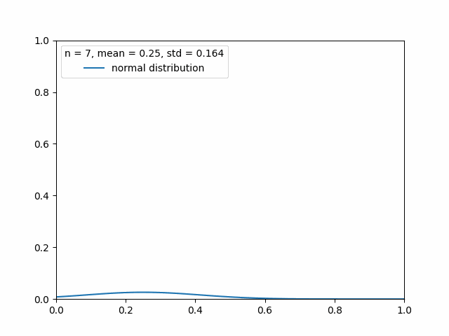

When people enter an apple store, $p=0.25$ of them buys a product before leaving(this is the real proportion, it is the ground truth and we have it).

Imagine we sample the population and try to obtain p from the samples. 
Now P becomes uncertain, it is [random variable](../Probability/Random%20variable.md) $\hat{P}$:

According to the [Central Limit Theorem](Central%20Limit%20Theorem.md), for large samples, the sample proportion is approximately normally distributed, with mean:
$$\large\mu_{\hat{P}}= p$$
and standard deviation of a proportion:
$$\large\sigma_{\hat{P}}=\sqrt{\frac{pq}{n}}$$

Where:
- $p$ is the proportion/statistic of something.
- $q = 1-p$
- $\mu_{\hat{P}}$ is the mean of the distribution of sampled proportions.
- $\sigma_{\hat{P}}$ is the standard deviation of the sampled proportions.

If we are investingating a mean(not a proportion) the formula for standard deviation is:

$$\large \sigma_s = \frac{\sigma}{\sqrt{n}}$$

> [!warning]
> Sometimes we want to compute the probability of successes being more than a certain number. 
> 
> We know that we can get the area under a curve by using the z-scores, but this distribution only approximates a [normal distribution](Normal%20distribution.md) when using a large n.
> 
> So when we have a small n we need to go sideways:
> - If our configuration is also a [binomial distribution](../Probability/Bernoulli%20distribution.md), we can use that formula to compute every single discrete probability.
> 

> [!example]
> **For the population of individuals who own an iPhone, suppose p = 0.25 is the proportion that has a given app.**
> 
> 1. For a random sample of size n = 4, and the mean and the standard deviation of the sampling distribution of the sample proportion:
> 	$$\large \mu_{\hat{P}}=0.25, \quad\large \sigma_{\hat{P}}=\sqrt{\frac{0.25 \times 0.75}{4}}=0.216$$
> 	
> 
> 
> 2. Find the probability that the proportion of having the app is at least 0.75 when n = 4.
> 	
> 	Here the sample size is too small, so we can't use the [normal distribution](Normal%20distribution.md) stuff.
> 	0.75 of 4 = 3, so we need the probability that at least 3 people have the app. 
> 	We do that by  summing the probabilities that 3 people have the app and 4 people have the app.
> 	Since those probabilities are discrete and there are only 2 possible outcomes per trial, we can use the binomial distribution formula
> 	

> [!example]
> **In the population, IQ scores are normally distributed with mean µ = 100 and variance σ 2 = 15. Suppose to draw a random samples of 25 individuals from the population and measure the IQ score**
> 
> 1. Compute the probability of observing a sample mean between 98 and 102 when drawing a sample of 25 individuals:
>   
> The standard deviation of the sample mean for a sample of size 25. Is given by:
> $$\large\sigma_s = \frac{\sigma}{\sqrt{n}}=\frac{\sqrt{15}}{\sqrt{25}}=0.774$$ 
> 
> The z-scores for 98 and 102 are:
> $$\large z_1 = \frac{98-100}{0.774}=-2.582,\quad z_2 = \frac{102-100}{0.774}=2.582$$
> 
> The areas given by the z-tables for the z-scores are:
> $$\large A_{z1}=0.0049,\quad A_{z2}=0.9950$$
> 
> The area between the two z-scores is given by:
> $$\large A_{z2-z1} = A_{z2} - A_{z1} = 0.9950 - 0.0049 = 0.9901$$
> 
> 

