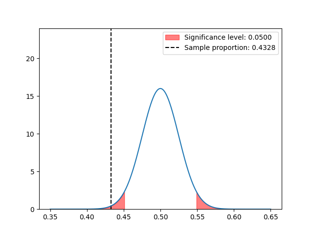

I will explain using an exercise:

**In a sample of 402 Tor Vergata first-year students, 174 are enrolled into Statistics course.**

**Is the proportion of students enrolled into Statistics course in the population of all Tor Vergata first-year students different from 0.50 at the [significance level](Significance%20Level.md) α = 0.05?**

### 1. Assumptions

The distribution approximates to a [[Normal distribution|normal distribution]] because of the large sample size.

### 2. Hypothesis

We are given an hypothesis:

$$\large H_0 : p=0.5,\quad H_1: p \neq 0.5$$
Where:
- $H_0$ is the actual hypothesis, or null hypothesis.
- $H_1$ is the alternative hypothesis.

In a significance test, the null hypothesis is presumed to be true unless the data give strong evidence against it.

### 3. Test statistic

A test statistic measures how far the point estimate falls from the parameter value given in the null hypothesis. The result is the number of [[Standard Error|standard errors]] between the two.

First, we construct the [[Normal distribution|normal curve]] considering the hypothesis:

$$\large n=402,\quad p= 0.5,\quad\sigma=\sqrt{\frac{pq}{402}}=0.0249$$
Then we take the sample:
$$\large\quad\hat{p}=\frac{174}{402} = 0.4328$$

We can already see from the plot that this sample proportion really doesn't agree with our hypothesis. 
Mathematically, to disprove the hypothesis we need to check if the sample mean/proportion lands beyond the [[Significance Test|significance level]] threshold.

In order to do just that, we need the [[Z-score]] for the sample proportion, also called the test statistic:

$$\large z=\frac{0.4328-0.5}{\sigma}=-2.6947$$

Now we compute the areas under the curves to determine whether the sample proportion exceedes the $\alpha$ threshold or not.

### 4. p-value

This is just the area under the curve at the left of the test statistic value. We can later compare it with the significance level to see if we really are out of bounds.

$$\large\text{p-value}=P(Z<\text{test statistic})\times2=P(Z<-2.6947)\times2=0.0035\times 2=0.0070$$

> [!hint] Why x2?
> Because the significance level $\alpha$ is the area under both tails of the distribution.
> So we can either use $\Large \frac{\alpha}{2}$ or $\text{p-value}\times2$ when comparing.
> 
> 

### 5. Conclusion

Once we have the p-value, we proceed to either accept or reject the hypothesis by comparing the two area
- If $\text{p-value} < \alpha$, we reject $H_0$
- If $\text{p-value} \geq \alpha$, we accept $H_0$

In this case $0.0070 < 0.05$, so we reject the hypothesis.