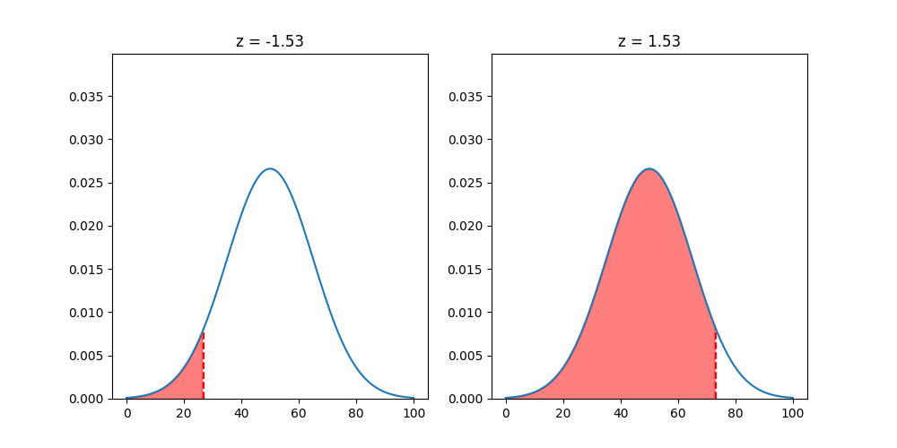

It epresents the number of [[Standard Deviation|standard deviations]] an observation is from the mean.

$$\huge z=\frac{x-\mu}{\sigma}$$

## A more extensive explanation

Some exercises may ask you to calculate the probability in an interval of the Normal distribution.

I think you would do this with integrals, but i guess that integrating the normal distribution might not be easy?

> [!example] Sample exercise
> In a population the vehicle speed distribution is well approximated by a Normal curve with mean 50 and standard deviation 15.
> 
> - **Compute the probability that a randomly selected vehicle speed is greater than 73**

### What is a [z-score](Z-score.md) and what's its purpose:

Basically the z-score is how many standard deviations our value is away from the mean.
The z-score is useful because it is standardized for every normal curve.

Basically if we get an exercise like the one above, where we would need to use an integral, we have a table of ready-to-go values, the z-table.

### The z-table:

The z-table assigns to every z-score the area under the curve up to that z-score(the left of it).
The table is computed from the standard normal curve, but the z-score is standardized, so if our distribution follows a normal curve we can use the table.

Getting back to the exercise:

**Compute the probability that a randomly selected vehicle speed is greater than 73:**

1.    We compute the z-score:
$$\large z = \frac{x - \mu}{\sigma} = 1.53$$

2.    Now we've got to use the z-table to find the area corresponding to the z-score of 1.53:

We use the entry -1.5 because if we used 1.53 we would get all the area to the left of 1.53, and we want the area to the right. We can use the negative z because the normal distribution is symmetric:

Our result is **0.063**.

> [!info]
> We could have also computed the complement of the area, instead of getting the inverse of the z-score.
> 
> This is because the total area of the normal curve is 1.
